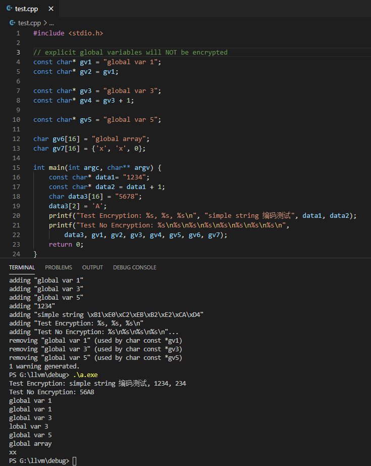
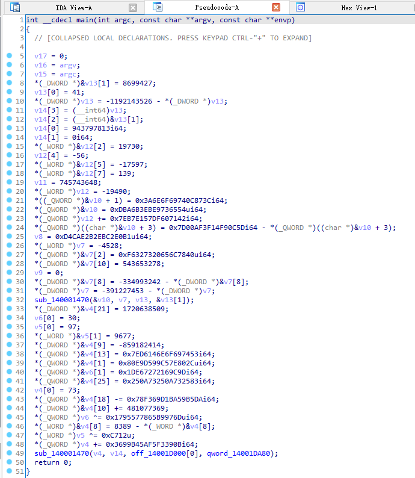

# LLVM
A LLVM fork that supports Dynamic String Encryption

Check implementation: [DynStrEnc.cpp](llvm/lib/Transforms/Obfuscation/DynStrEnc.cpp)

# Usage
use clang with command-line argument `-mllvm -obf-dse`

strings in source code will be encrypted.

# Example

