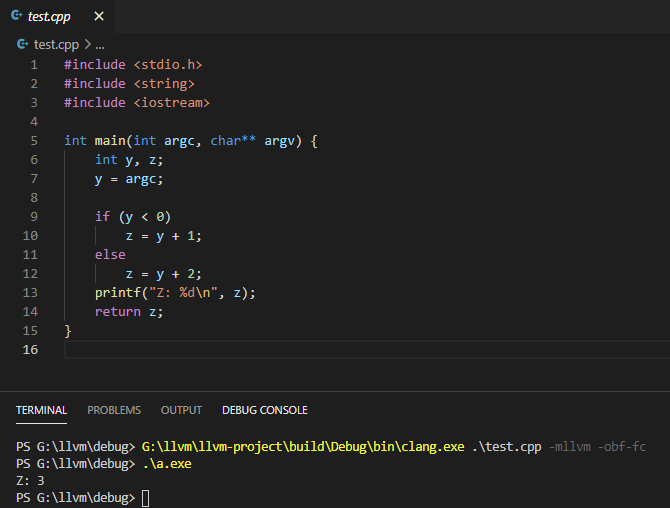
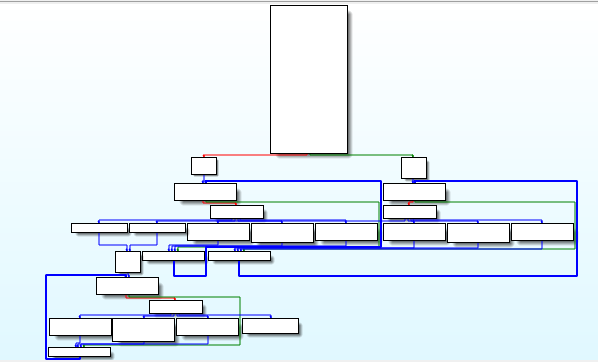

# LLVM
A LLVM fork that supports Dynamic String Encryption and Function Crusher.

Check implementation:
* [DynStrEnc.cpp](llvm/lib/Transforms/Obfuscation/DynStrEnc.cpp)
* [FunctionCrusher.cpp](llvm/lib/Transforms/Obfuscation/FunctionCrusher.cpp)

# Usage
use clang with command-line argument `-mllvm -obf-dse` and/or `-mllvm -obf-fc`

# Features

### Dynamic String Encryption
CString/WStrings in source code will be encrypted inline.

### Function Crusher
Split every instructions and dispatch them in loops.
This can be seen like an enhanced implementation of **Control Flow Flattening**

# Example

### Dynamic String Encryption

### Function Crusher

